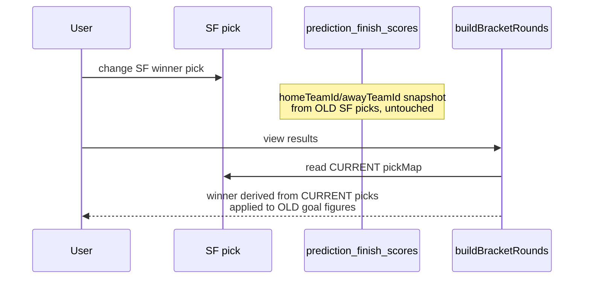
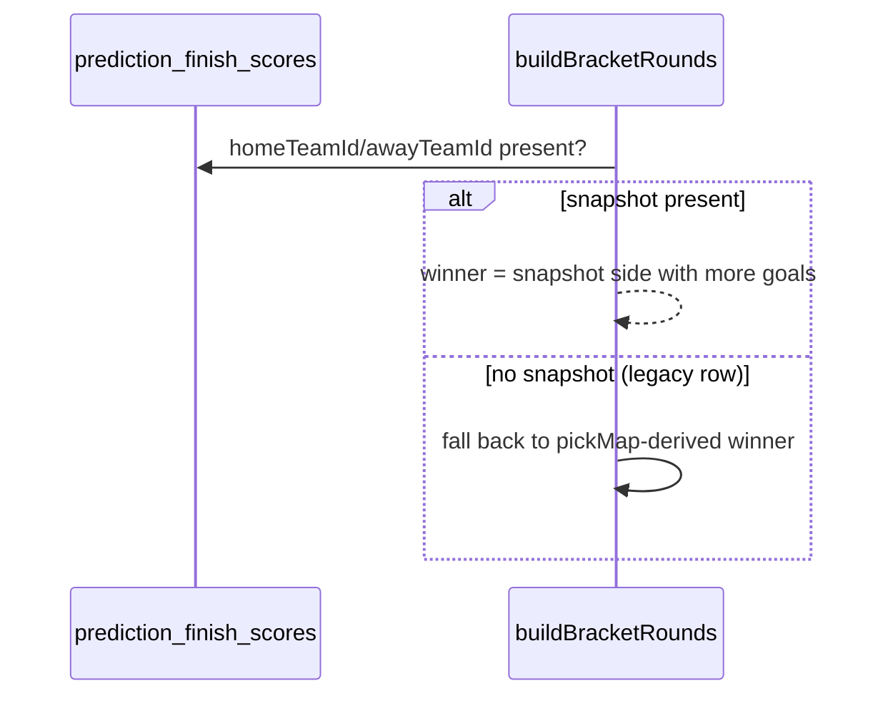
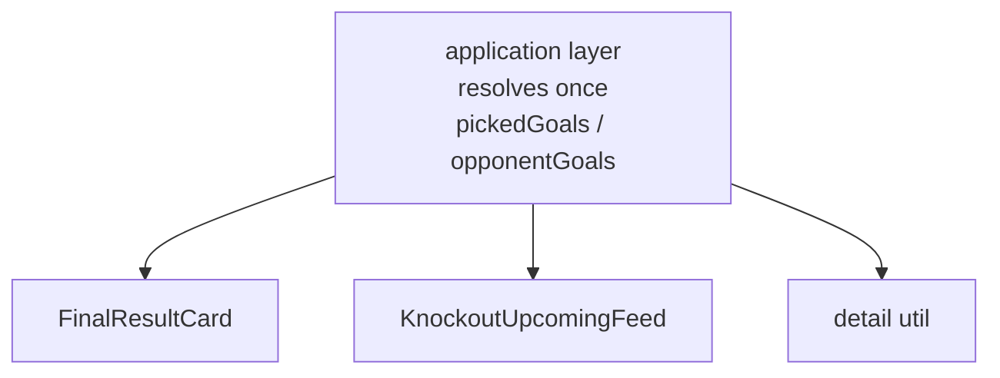
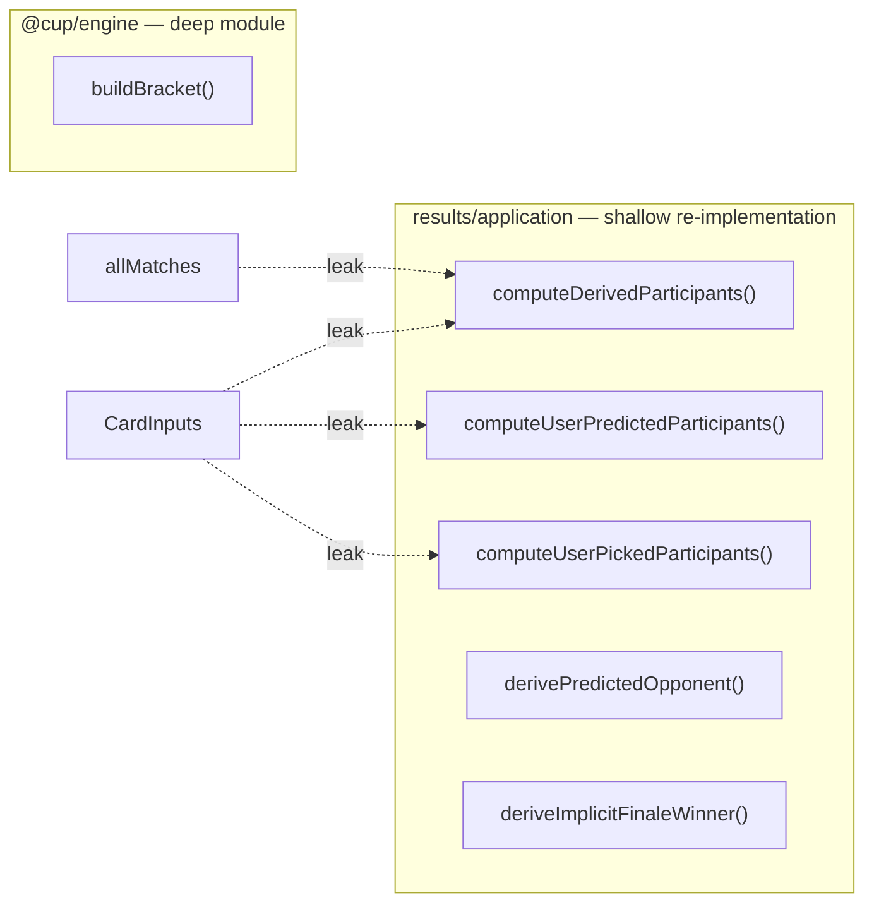
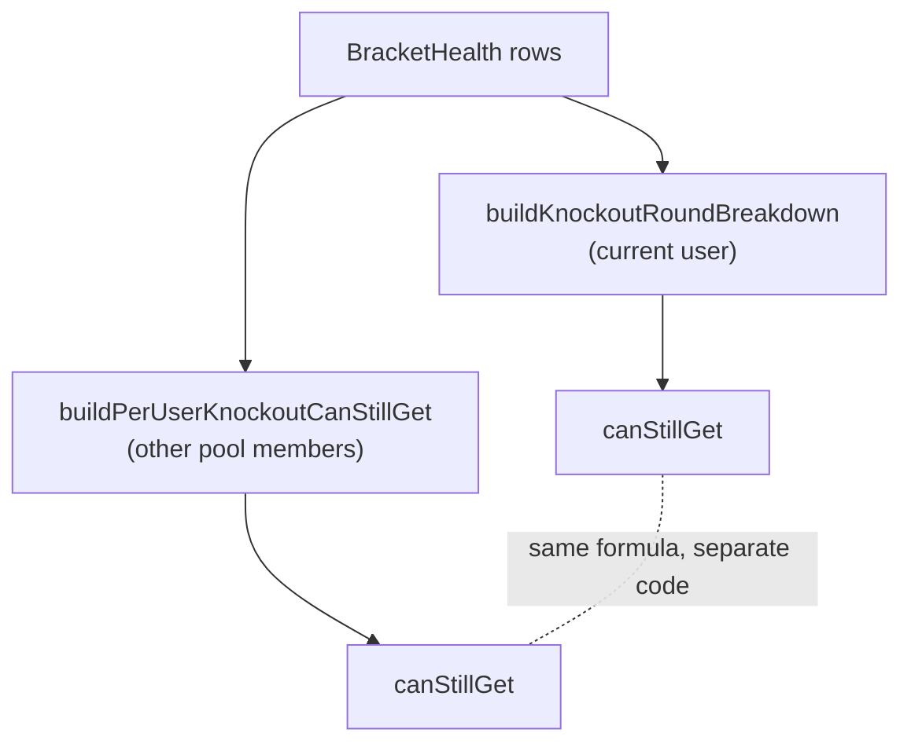

# Architecture review — prediction data model, results & scoring engine

**Date:** 2026-07-16
**Scope:** `packages/engine`, `apps/web/src/features/results`, `apps/web/src/features/predictions`
**Context:** commit `edaa4d0` fixed a Final/Bronze "predicted score shows wrong team" bug (positional
home/away resolved from _current_ bracket state instead of a team-identity snapshot taken at save
time). This review looks for other instances of the same bug class and for the deeper architectural
reason it kept recurring, per the recurring goal: **BE should send fully-resolved data to FE so the
FE just places it, without re-deriving anything.**

## Legend

`Strong` / `Worth exploring` / `Speculative` = recommendation strength. Findings are ordered by
priority, not by strength.

---

## 1. Final/Bronze winner resolution leaks position instead of identity — live recurrence

**Strength:** Strong · **live bug**
**Files:** `apps/web/src/features/results/application/build-bracket-rounds.ts:182-193`,
cf. `apps/web/src/features/results/application/build-race-view.ts:706-746` (correct sibling)

### Before (build-bracket-rounds.ts)



### After (snapshot-first, matches build-race-view.ts)



**Problem:** the just-shipped fix taught every consumer to prefer the home/away team-id snapshot over
positional re-derivation from current picks — except this one call site, which still derives the
effective winner from the live `pickMap` whenever no explicit knockout pick is stored. That's exactly
the state `invalidatePicksAfterKnockoutPickChange` leaves things in after an SF pick changes: it
deletes the stale explicit Final/Bronze pick but leaves the finish-score snapshot untouched.

**Solution:** check `finishScoreForKey.homeTeamId/awayTeamId` first and resolve the winner from the
snapshot directly; only call `deriveImplicitFinaleWinner` against the live pickMap when no snapshot
exists (pre-migration rows).

**Wins:**

- Locality: one resolution rule, not two divergent copies
- Closes the exact scenario the backfill script was written to guard against
- One-line guard, one new test: "SF pick changes after finish score saved"

---

## 2. "Resolve goals by team identity" is re-implemented three times in the UI layer

**Strength:** Strong · **Status: implemented (2026-07-16)**
**Files:** `ui/FinalResultCard.tsx:196-207`, `ui/KnockoutUpcomingFeed.tsx:47-58`,
`domain/knockout-match-detail.ts:56-59`

> **Implementation note:** the original "add plain `pickedGoals`/`opponentGoals` fields" solution
> below doesn't hold up under inspection — `FinalResultCard.tsx` resolves goals for whichever team
> ends up on the visual left/right side after a multi-step fallback chain (`pickedHomeTeamId` →
> `pickedWinnerId` → `pickedOpponentId` → `homeTeamId` → `predictedHomeTeamId`), which isn't always
> `pickedWinnerId`/`pickedOpponentId`. Fixed fields would silently return `null` for a tied-score edge
> case the old generic lookup handled correctly. Implemented instead as a shared pure function,
> `resolveGoalsByTeamId(scoreByTeam, teamId)` (`domain/predicted-goals.ts`), used by all three call
> sites in place of each one's own `new Map(...).get(...)`. This removes the literal duplication
> (same win: one implementation, three call sites) without changing any consumer's actual field
> shape or introducing a regression. The three-fixed-fields version remains available as a future,
> larger step if the two straightforward consumers (`KnockoutUpcomingFeed`, `knockout-match-detail`)
> are ever worth decoupling from `FinalResultCard`'s more complex resolution.

### Before — three shallow readers

| Consumer                   | What it does                                            |
| -------------------------- | ------------------------------------------------------- |
| `FinalResultCard.tsx`      | `new Map(predictedScoreByTeam)` → `.get(pickRowLeftId)` |
| `KnockoutUpcomingFeed.tsx` | `new Map(...)` → `.get(pickedWinnerId)`                 |
| `knockout-match-detail.ts` | `new Map(...)` → `.get(pickedTeamId)`                   |

Same lookup, same shape, written three times — each component receives the raw
`predictedScoreByTeam` pair array and re-derives its own two numbers.

### After — resolved once



**Problem:** `KnockoutMatchView` hands components a `predictedScoreByTeam: {teamId, goals}[]` pair and
lets each caller build its own `Map` and look up the id it cares about. This is the FE-side processing
that should be gone — the interface is barely narrower than the lookup itself.

**Solution:** resolve `pickedGoals` and `opponentGoals` once, in the application layer that already
knows `pickedWinnerId`/`pickedOpponentId`, and add them as plain number fields on `KnockoutMatchView`.
Delete `predictedScoreByTeam` from the view once nothing reads it directly.

**Wins:**

- Leverage: one interface, three call sites simplify to prop reads
- Removes the only place components touch team-identity resolution at all
- Matches the stated goal: FE places data, doesn't compute it

---

## 3. Bracket topology walk is re-implemented outside the engine

**Strength:** Strong · **Status: partially implemented (2026-07-16)**
**Files:** `apps/web/src/features/results/application/build-bracket-rounds.ts` (1088 lines) ·
cf. `packages/engine/src/bracket.ts` (`buildBracket`)

> **Implementation note:** the full solution below — widening the engine's `buildBracket()`
> interface to cover projected/live-standings participants and moving the whole topology walk
> there — was not attempted; it's a large, cross-package change (the results feature's inputs are
> `MatchRow[]` from `@cup/db`, not the engine's pure `ActualMatchResult` shape, so the walk can't
> move wholesale without a translation layer) and out of proportion to this session. What _was_
> extracted: the two genuinely byte-identical duplicated pure functions found while investigating —
> `resolveActualWinner` (a.k.a. `getMatchWinner`/`resolveKnockoutWinner`, three verbatim copies
> across `build-bracket-rounds.ts`, `build-race-view.ts`, and `special-bet-impossibility.ts`) and
> `computeKnockoutEliminatedTeams` (two verbatim copies) — into one shared, unit-tested module,
> `domain/knockout-match-winner.ts`. The four bracket-walking functions this finding named
> (`computeDerivedParticipants`, `computeUserPredictedParticipants`, `computeUserPickedParticipants`,
> `deriveImplicitFinaleWinner`/`derivePredictedOpponent`, the latter two already centralized under
> candidate 5) remain un-consolidated — they encode results-specific policy (projected vs. actual
> participants, cross-slot pick correction) that isn't just duplicated boilerplate, and merging them
> into the engine remains the higher-effort, higher-risk work this finding originally described.



**Problem:** the engine's `buildBracket()`/`deriveCard()` is the documented single source of truth for
"resolve the bracket from a full CardInputs" — but the results feature needs extra views the engine's
interface doesn't expose (projected participants from live standings, per-slot resolution against real
match rows, cross-slot pick correction when a user's group prediction was wrong). Rather than widen the
engine's interface, the results feature grew four bracket-walking functions of its own, each subtly
re-deriving winner/loser/home/away resolution with its own fallback order. This is the root cause
class: every time a new "who is home here" question comes up, it gets answered by a fresh positional
walk instead of one already-hardened resolver.

**Solution:** extend the engine's public interface with the missing query shapes (e.g.
`buildBracket(tournament, { actualMatches, liveStandings })` returning participants + confirmed-ness
per slot) so the results feature stops walking `bracket.progression` by hand. `deriveImplicitFinaleWinner`
and `derivePredictedOpponent` move into the engine alongside `buildBracket`, where they're one hardened
implementation instead of a parallel one.

**Wins:**

- Locality: one bracket-topology walk, not four
- Deletion test: delete build-bracket-rounds.ts's walkers → the topology logic reappears verbatim in
  build-race-view.ts, so it's earning its keep as duplication, not as a pass-through
- Tests move to the engine's pure, dependency-free package — no DB/pglite needed to test topology
  edge cases

---

## 4. "Can still get" ceiling math: two untested-for-parity implementations

**Strength:** Worth exploring
**Files:** `get-results-view.ts:258 buildKnockoutRoundBreakdown` (current user) ·
`build-race-view.ts:269 buildPerUserKnockoutCanStillGet` (every other user)



**Problem:** scoring.md §4 documents the same ceiling formula (membership + position-bonus, Final/Bronze
busted-pair counting) implemented once for "your own path" and once for "everyone else's row in the
projected-standings table." Nothing asserts the two agree for the same user — the current user's own
number could legitimately diverge from what the projected-standings table shows for that same person,
and no test would catch it.

**Solution:** one `computeKnockoutCanStillGet(bracketHealth, finalHealth, ...)` in the engine or a
shared results-domain module, called from both call sites with the caller-specific inputs. Add a
parity test: for any user, "my own path" and "the race-view row for me" must produce identical numbers.

**Wins:**

- Leverage: one formula, two call sites
- Removes a drift risk that's currently invisible to tests

---

## 5. Optional team-id snapshot is a shallow escape hatch by construction

**Strength:** Strong · **Status: partially implemented (2026-07-16)**
**Files:** `packages/engine/src/types.ts:109-119` (`FinishScore`)

> **Implementation note:** the discriminated-union type change below was not made — `FinishScore`
> is used across ~15 files including the predict page's live-editing flow (`BracketSection.tsx`,
> `OwnerCardEditor.tsx`), where a genuinely third state exists that doesn't fit a `resolved | legacy`
> union: a score just entered, pair not yet known (not "legacy," just "not yet resolvable"). Reshaping
> the type risked a much wider, riskier change than this review's scope. Implemented instead: the
> "snapshot-first, fall back to live-pickMap derivation" _decision_ — the actual duplicated logic
> candidate 1 found re-broken in a sibling file — is now centralized in one function,
> `resolveFinaleWinner()` (`domain/finale-winner.ts`), unit-tested directly, and used by both
> `build-bracket-rounds.ts` and `build-race-view.ts` instead of each having its own copy of the rule.
> This closes the "next sibling-file recurrence" risk without the type reshape. The discriminated
> union remains available as a future, larger step if the optional-field ambiguity causes another
> incident.

### Before

```ts
interface FinishScore {
  home: number;
  away: number;
  homeTeamId?: TeamId | null;
  awayTeamId?: TeamId | null;
}
```

Every new consumer compiles cleanly whether or not it handles the identity snapshot — the type system
enforces nothing. This is how candidate 1's bug slipped past review in a sibling file within the same
fix.

### After

```ts
type FinishScore =
  | { kind: 'resolved'; home: number; away: number; homeTeamId: TeamId; awayTeamId: TeamId }
  | { kind: 'legacy'; home: number; away: number };

function resolveWinner(fs: FinishScore, pickMap): TeamId | null {
  switch (fs.kind) {
    case 'resolved': return fs.home > fs.away ? fs.homeTeamId : fs.awayTeamId;
    case 'legacy':   return deriveImplicitFinaleWinner(...);
  }
}
```

A missing `case` is a compile error, not a silent fallback to the wrong branch.

**Problem:** the optional-fields shape is exactly the "interface as wide as the implementation, but the
implementation still has an escape hatch" pattern — depth without enforcement. Once the production
backfill (`scripts/backfill-finish-score-team-ids.ts`) completes, "legacy" rows without a snapshot won't
exist anymore, so the fallback branch becomes dead code the type system should be able to say so about.

**Solution:** a single `resolveFinishWinner(fs, pickMap)` function in the engine, built on a
discriminated union, called everywhere a Final/Bronze winner needs resolving
(build-bracket-rounds.ts, build-race-view.ts, actions.ts's `deriveFinishWinner`). One switch,
exhaustively checked.

**Wins:**

- Leverage: the compiler catches the next sibling-file recurrence instead of a bug report
- Pairs directly with candidates 1 and 3 — same seam

---

## 6. Positional tuples for teams that aren't interchangeable

**Strength:** Speculative
**Files:** `packages/engine/src/types.ts:145-160` — `finalists`, `bronzePair`, `topFour: TeamId[]`

**Problem:** `finalists`, `bronzePair`, and `topFour` are all plain `TeamId[]`. Ordering carries meaning
(index 0/1 correspond to specific slots in some call sites, are "unordered" in others per the docs),
but nothing in the type says which. This is the same shape of risk as candidates 1 and 5, one level up
the derivation chain — currently mitigated only by comments and test coverage, not by the compiler.

**Solution:** structured fields (`{ finalWinnerSlot: TeamId; finalLoserSlot: TeamId }` or similar)
wherever order is semantic; keep the array only where the docs already say "order-agnostic" (e.g.
`roundOf4` membership).

> Speculative because functional-spec §6 already treats these as ordered arrays by convention
> (`[finalWinner, finalLoser, bronzeWinner, bronzeLoser]`) and reworking the type is a wider,
> cross-cutting change — worth revisiting only if candidates 1-5 don't fully close the bug class.

---

## Top recommendation

**Fix candidate 1 immediately, then deepen the same seam with candidates 5 and 2.**

Candidate 1 is a live, reachable bug in the same code path just patched — ship the snapshot-first
guard before the real Final is played, it's a few lines and one test. Candidates 5 and 2 close the seam
that keeps producing this bug class: a discriminated `FinishScore` type (5) makes the next accidental
positional read a compile error, and resolving `pickedGoals`/`opponentGoals` once in the application
layer (2) is the concrete first step toward "BE sends fully-resolved data, FE just renders." Candidate 3
is the deeper structural fix but is the highest-effort — worth a separate session once 1/2/5 are shipped.
